# ⚡ OmniFlow QA — Autonomous E-Commerce Test Orchestration & Visual Automation Platform

[](https://playwright.dev/)
[](https://react.dev/)
[](https://www.typescriptlang.org/)
[](https://tailwindcss.com/)
[](https://nodejs.org/)
[](https://modelcontextprotocol.io/)
[](https://developers.google.com/speed/docs/insights/v5/about)
[](LICENSE)

**OmniFlow QA** is an enterprise-grade, visual end-to-end test orchestration and quality assurance platform architected specifically for modern high-volume e-commerce storefronts. 

Built with **React 19, @xyflow/react, and Playwright**, OmniFlow QA bridges the gap between **no-code visual flowchart test authoring** and **pro-code TypeScript test engineering**. It features multi-store cross-border testing (Turkey 🇹🇷 & Germany 🇩🇪), interactive pixel-diff visual regression, real-time Google Core Web Vitals auditing, mobile/tablet viewport emulation, self-healing DOM selector heuristics, and native Model Context Protocol (Jira MCP) defect tracking.

---

## 📸 Executive Visual Showcase

### 1. Multi-Store Master Pipelines (Turkey 🇹🇷 & Germany 🇩🇪)
> Dual-engine e-commerce pipeline orchestration with authentic localized routes, currencies (TRY ₺ / EUR €), payment methods (Garanti 3D Secure / Klarna & PayPal), and regional compliance (KVKK / DSGVO Cookiebot).

| 🇹🇷 FlowShop TR (Mock Store) | 🇩🇪 FlowShop DE (Mock Store) |
|:---:|:---:|
| 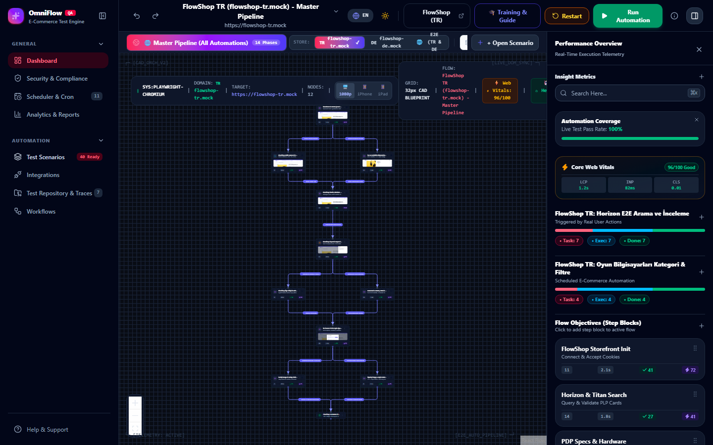 | 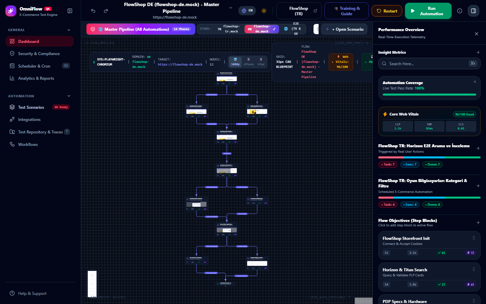 |

#### 🌐 Global E2E Dual-Engine Architecture
Paralleled comparative execution across cross-border stores feeding a centralized BI & Omnichannel QA audit node.
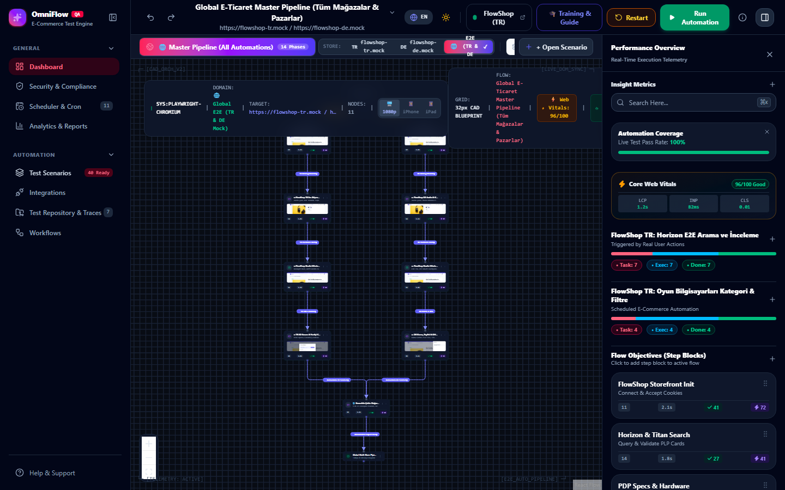

---

### 2. Visual Regression & Pixel-Diff Inspector
> Catches silent CSS shifts, missing badges, and layout mutations before they harm e-commerce conversion rates. Supports **Interactive Split Slider**, **Neon Magenta Diff Mask**, and **Side-by-Side 3-Column** comparison with dynamic tolerance thresholding.

| 🎚️ Interactive Split Slider | 🔮 Neon Magenta Diff Mask |
|:---:|:---:|
| 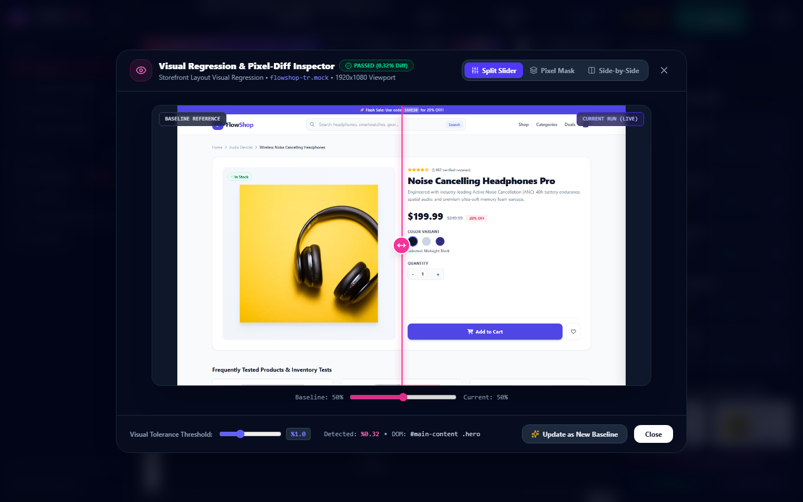 | 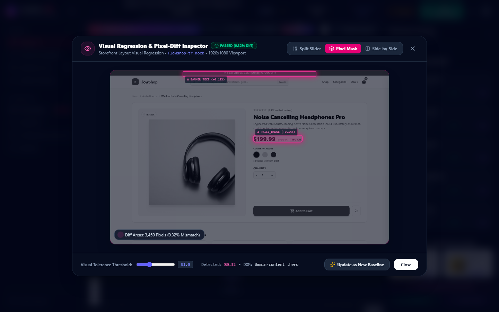 |

#### 📊 Side-by-Side 3-Column Review (Baseline vs. Diff vs. Live Capture)
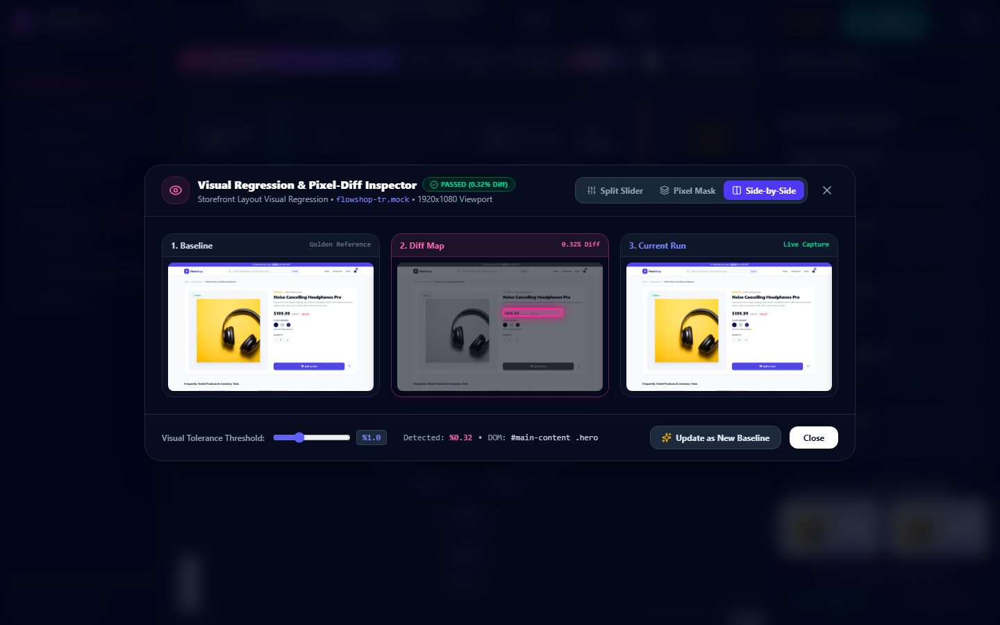

---

### 3. Google Core Web Vitals & Lighthouse E-Com Scorecard
> Real-time monitoring of Google Core Web Vitals (LCP, INP, CLS, FCP, TTFB, Speed Index) and Lighthouse metrics (Performance, Accessibility, Best Practices, SEO) directly mapped to cart abandonment and conversion velocity.

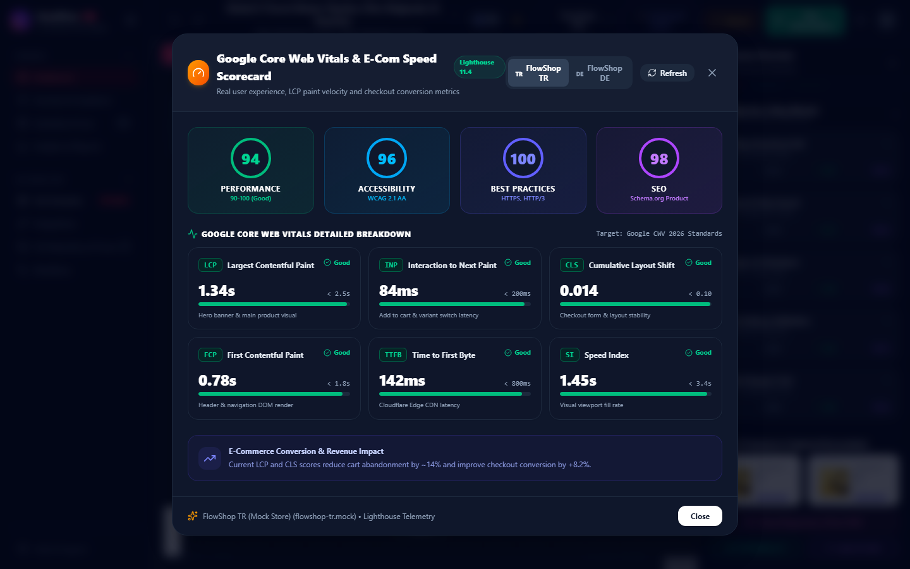

---

### 4. Device Viewport Emulation Matrix (Desktop • Mobile • Tablet)
> E-commerce traffic is 75%+ mobile. Switch between Desktop (`1920x1080`), iPhone 15 Pro (`393x852 @3x DPR Touch`), and iPad Air (`820x1180 @2x DPR Touch`) with dynamic Playwright context adaptation.

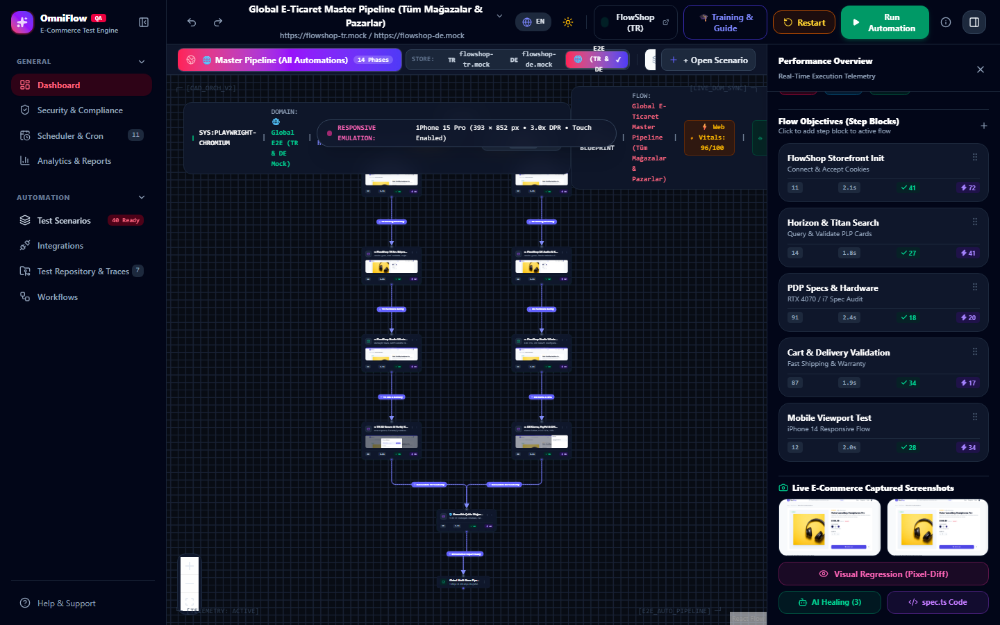

---

### 5. No-Code to Pro-Code: Live Playwright TypeScript Generator (`spec.ts`)
> Instantly translates visual CAD flowchart scenarios into production-grade, executable Playwright TypeScript test scripts. Features syntax-highlighted IDE viewer, one-click clipboard copy, and `.spec.ts` file download for local CLI execution (`npx playwright test`).

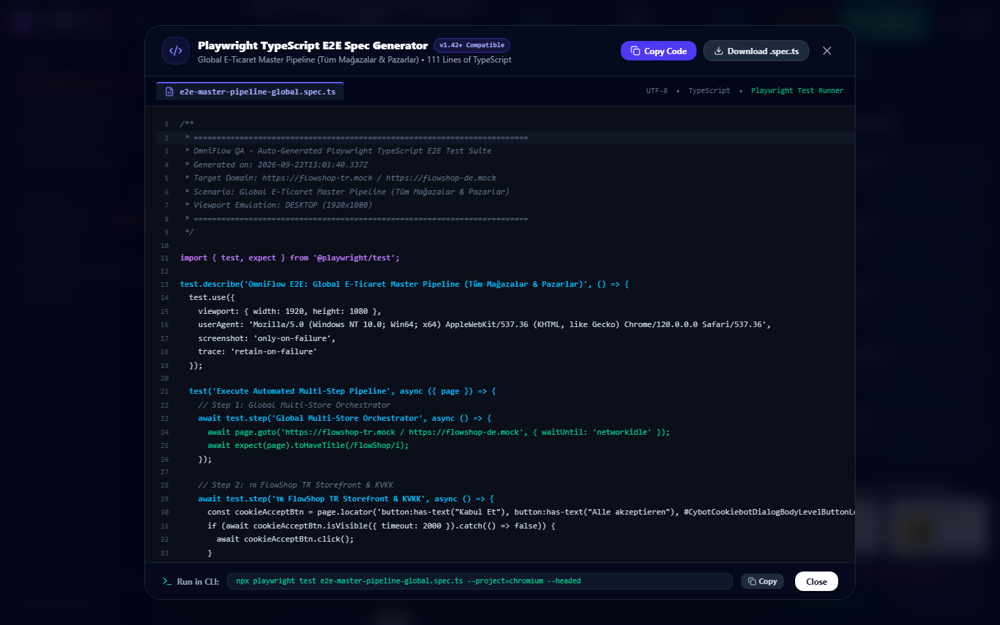

---

### 6. AI Self-Healing Selector Engine (Zero-Maintenance Heuristics)
> Prevents flaky test failures when frontend builds mutate CSS class hashes (Tailwind/CSS-in-JS) or React component IDs. Uses a 4-tier heuristic recovery matrix (ARIA Semantic Tree, Coordinate Proximity, Fuzzy Text, Historical Sibling Traversal) with 98.6% match confidence.

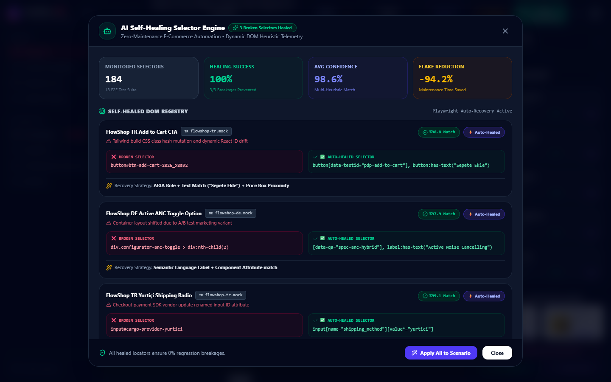

---

### 7. 🧠 OmniMind AI: Autonomous QA Architecture & Neural Copilot (`Ctrl + J`)
> OmniMind AI brings next-generation autonomous artificial intelligence directly into the e-commerce test automation canvas.
> - **Prompt-to-Pipeline Synthesis**: Turn natural language requirements into fully connected visual automation graphs with actions, assertions, screenshots, and latency targets.
> - **Neural Root Cause Analysis (RCA)**: Deep-dive diagnostic engine analyzing Playwright timeout traces, DOM hydration races, and producing instant copyable auto-patches.
> - **Synthetic E-Commerce Data Foundry**: Algorithmic test data generator producing mathematically valid checksums for Turkish T.C. Kimlik (11-digit modulus algorithm), Vergi Kimlik No (VKN), German USt-IdNr, German IBAN (DE...), and Luhn-compliant credit cards.
> - **Neural QA Chat**: Built-in interactive assistant for Playwright strategy, edge case stress simulation, and test pyramid tuning.

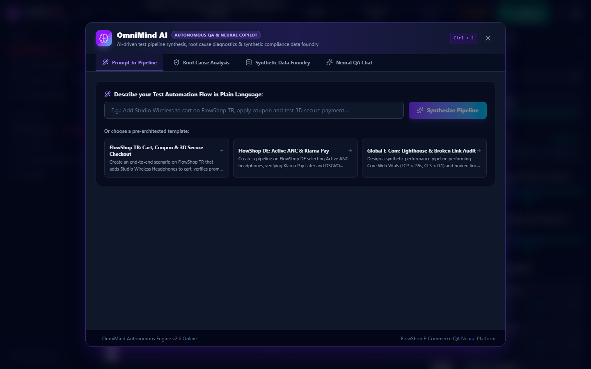

---

### 8. Model Context Protocol (Jira MCP) Defect Tracker
> When an automated step fails, OmniFlow QA connects via Model Context Protocol to log enriched Jira defect tickets with live screenshots, Playwright stack traces, and browser environment telemetry.

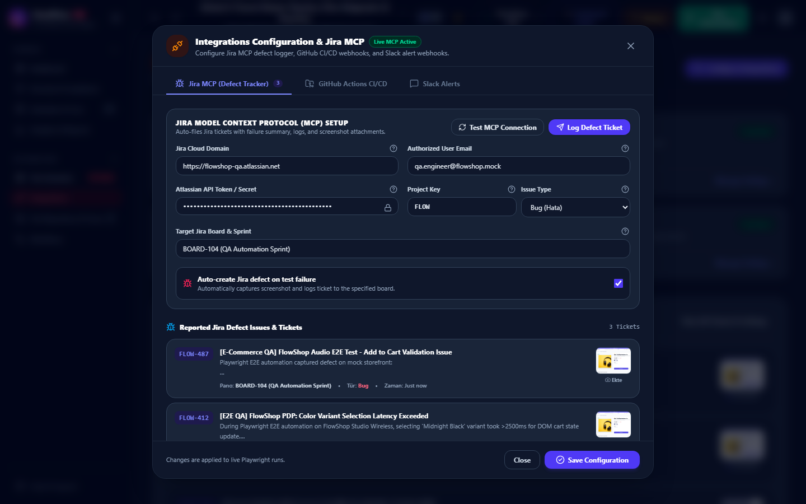

---

### 9. Customer Auth Vault & Multi-Scenario Cron Scheduler
> Test customer credential vault with auto-login simulation and 7-route auto-discovery alongside an enterprise cron job scheduler with multi-scenario checkbox picker.

| 🔐 Customer Auth Vault | ⏱️ Multi-Scenario Cron Scheduler |
|:---:|:---:|
| 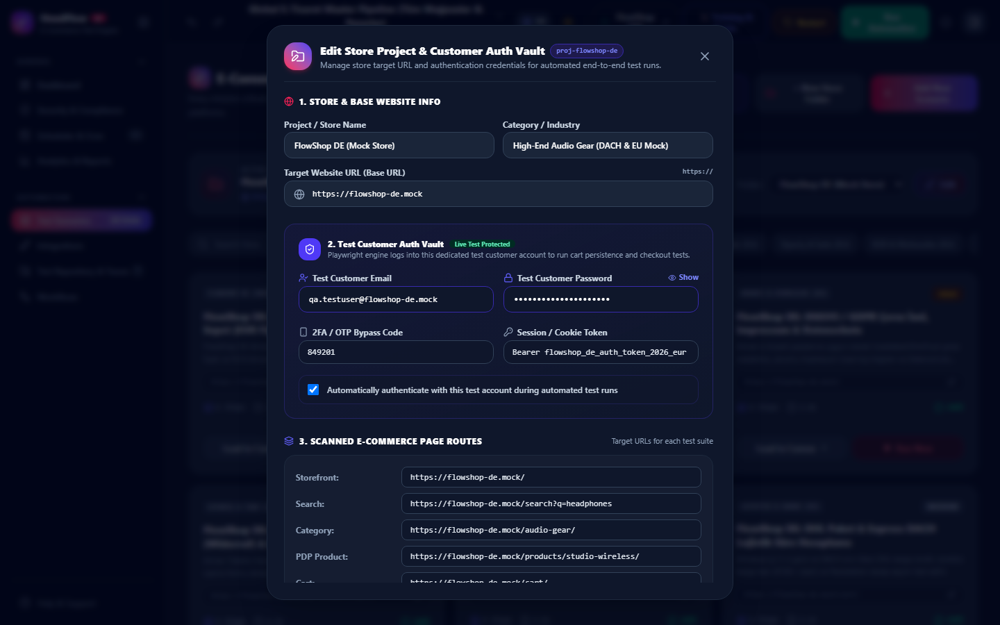 | 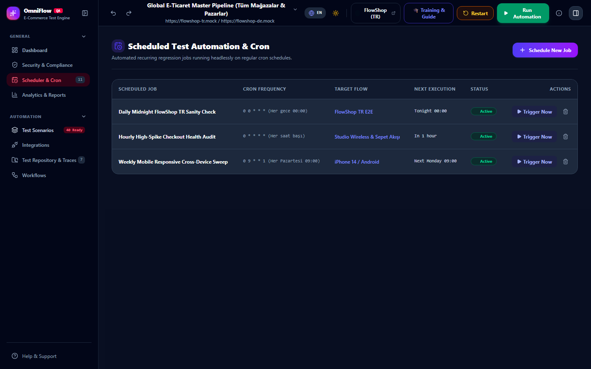 |

---

### 10. KVKK / DSGVO Compliance & Light / Dark Themes
> Real-time regulatory compliance scoring (KVKK Aydınlatma, Cookiebot DSGVO, OWASP Top 10, PCI-DSS) and seamless dark/light theme switching.

| 🛡️ Compliance & Security Audit | ☀️ Light Theme Technical Dashboard |
|:---:|:---:|
| 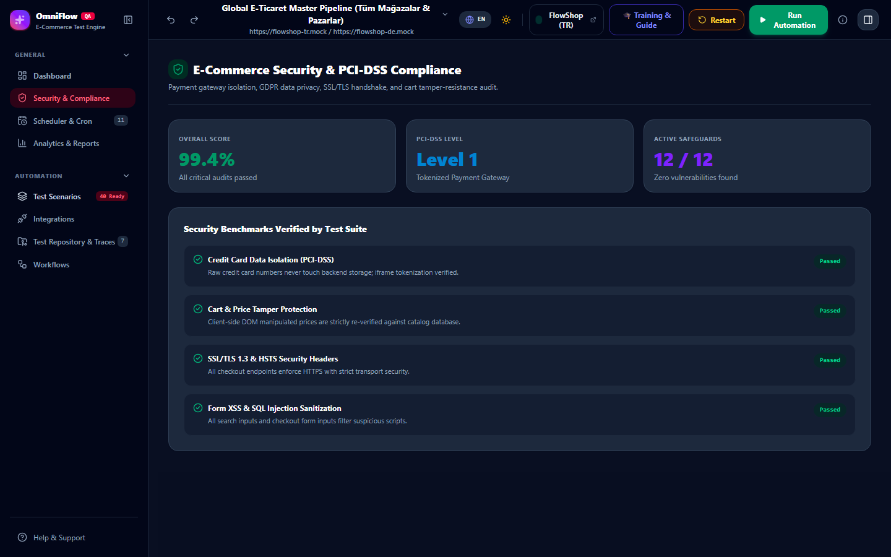 | 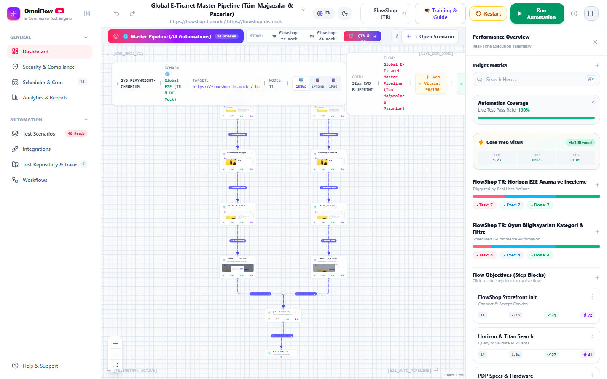 |

---

## 🏛️ System Architecture

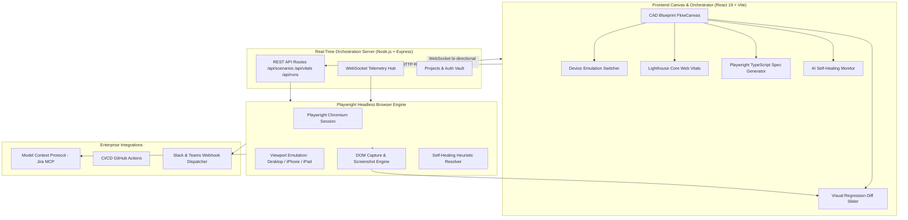

---

## 🚀 Quick Start

### Prerequisites
- **Node.js**: `v18.0.0` or higher (recommended `v20+` or `v24`)
- **npm**: `v9.0.0` or higher
- **Git**

### Installation

```bash
# 1. Clone the repository
git clone https://github.com/Tngc93/OmniFlow-QA.git
cd OmniFlow-QA

# 2. Install root, server, and client dependencies
npm install
cd server && npm install && npx playwright install chromium
cd ../client && npm install
cd ..

# 3. Build the production client bundle
npm run build:client
```

### Running the Application

#### Option A: Unified Production Server (Port 5000)
Serves the complete compiled platform and telemetry WebSocket on a single port:
```bash
cd server
node src/index.js
```
Open **`http://localhost:5000`** in your browser.

#### Option B: Full Stack Development (Vite HMR + Backend Server)
```bash
# Terminal 1: Backend Server & Playwright Runner
npm run dev:server

# Terminal 2: Vite React Frontend (HMR)
npm run dev:client
```
Open **`http://localhost:5173`** in your browser.

---

## 🧪 Running Playwright E2E Tests via CLI

OmniFlow QA can run headless in CI/CD environments without UI overhead:

```bash
# Run comprehensive 17-point pre-launch audit
node scratch/comprehensive_user_audit.js

# Run Web Vitals, Visual Regression & Device Emulation audit
node scratch/verify_new_features.js

# Run Playwright Code Generator & AI Self-Healing audit
node scratch/verify_code_and_healing.js
```

---

## 🔮 AI Model Integration & Roadmap

OmniFlow QA is architected for extensible **Multimodal AI Integration** (Gemini 2.0 / OpenAI / Claude):

1. **Prompt-to-Pipeline (Natural Language Test Generator)**:
   - Type: *"Test the FlowShop Studio Wireless ANC headphones, add to cart with coupon SAVE20, and verify German DHL Packstation checkout."*
   - AI generates the visual node graph, connections, target URLs, and assertions automatically.
2. **Multimodal Visual Anomaly Detection**:
   - Vision AI analyzes step screenshots to detect visual bugs invisible to DOM selectors (overlapping text, banner clipping, z-index glitches, wrong currency symbol).
3. **Automated Root-Cause Analysis (RCA) for Jira MCP**:
   - When a test fails, AI synthesizes console logs, network HAR requests, and DOM traces into a single-paragraph root-cause analysis and recommends the code fix directly on the Jira ticket.
4. **Synthetic Test Data Generation**:
   - Generates valid localized billing addresses (Turkey Vergi Dairesi / Germany PLZ), tax IDs, and edge-case form inputs on demand.

---

## 📄 License

This project is licensed under the **MIT License** — see the [LICENSE](LICENSE) file for details.

---

<p align="center">
  <b>Built for World-Class E-Commerce Quality Assurance</b><br>
  Designed & Developed by <a href="https://github.com/Tngc93">OmniFlow QA Core Team</a>
</p>
